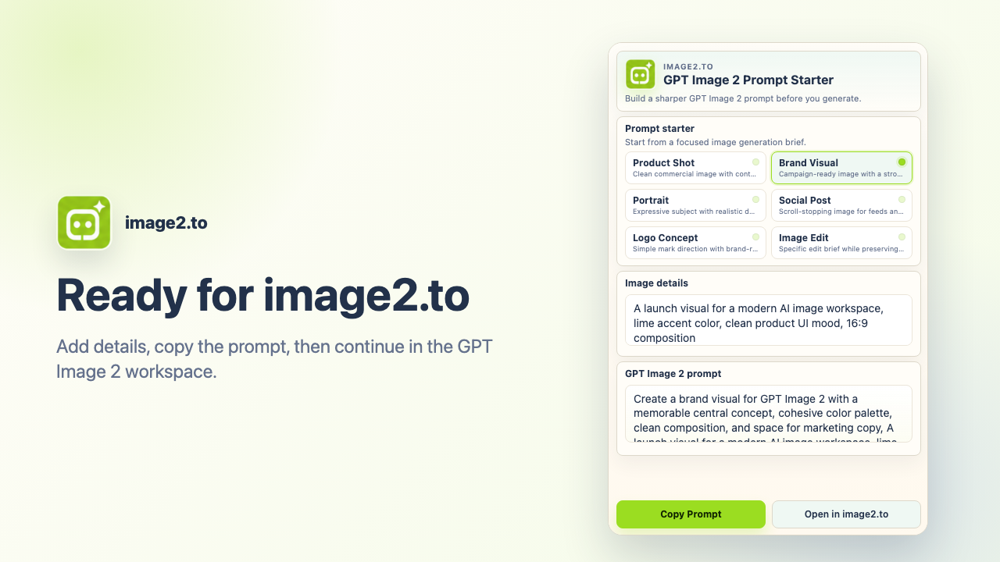

# image2.to GPT Image 2 Prompt Starter

A lightweight open-source Chrome side panel extension for building clearer GPT Image 2 prompts before moving into the full image generation workflow.

This project is designed as a browser companion for the [image2.to AI image workspace](https://image2.to). It keeps prompt drafting local, fast, and easy to review: pick a starter, add image details, copy the prompt, or continue to the generation page.

## Features

- Chrome MV3 side panel extension
- Six built-in GPT Image 2 prompt starters
- Custom detail field for subject, style, aspect ratio, text, lighting, and references
- Local prompt assembly with no account required
- One-click prompt copying
- Direct handoff to the [GPT Image 2 prompt workflow](https://image2.to/gpt-image-2)

## Why This Exists

Good image prompts usually need more structure than a quick idea typed into a blank box. This extension gives creators a compact prompt drafting surface that stays available in Chrome while researching, writing briefs, or preparing assets.

Use it to shape product shots, brand visuals, portraits, social posts, logo concepts, and edit briefs. The same prompt planning habits can also help when turning image ideas into motion with the [AI video generation workspace](https://image2.to/ai-video-generator).

## Privacy And Permissions

The extension is intentionally narrow in scope:

- it does not read webpage content
- it does not inject content scripts
- it does not request host permissions
- it does not upload user-entered prompt details
- it does not require sign-in
- it does not use remote code

The `storage` permission is used only to remember the latest selected starter and custom details inside the browser.

## Preview

## Local Install

1. Open `chrome://extensions`
2. Enable **Developer mode**
3. Click **Load unpacked**
4. Select this repository folder
5. Click the extension icon to open the side panel

## Project Files

- `manifest.json` - MV3 extension definition
- `popup.html`, `popup.css`, `popup.js` - side panel UI and prompt logic
- `service-worker.js` - side panel behavior setup
- `assets/logo.png` - extension logo
- `assets/icons/` - Chrome extension icons
- `assets/store/` - Chrome Web Store screenshots and promo image
- `docs/` - privacy policy, reviewer notes, and store listing copy

## Open Source Notes

This repository is kept small on purpose so the extension can be audited quickly. Contributions should preserve the same privacy posture: no host permissions, no content scripts, no remote code, and no prompt upload from the extension.
